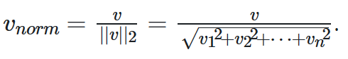

# TF-IDF（词频-逆文档频率）
***

## 算法原理
- TF（词频）。根据**词汇表**,统计每个词出现次数。TF越大，说明词汇越重要
- IDF（逆文档频率）。总文档数量为n，出现某词汇的文档数量为m，IDF=ln((n+1)/(m+1))。IDF越大，说明词汇只在少数文档出现，越重要
***
## 缺点及优化
TF-IDF是计算**关键字**的简单算法，缺点：对停用词敏感，以及没有规范化，实际sklearn已经有这方面优化

***
## 手动实现
`python My_TFIDF.py`
***
## 算法应用
TF-IDF主要作用是提前关键词，也可以用TF-IDF计算文档的向量，用于分类
- 提取关键词。`python extract_keyword.py`
- 分类器。`python classifier.py`